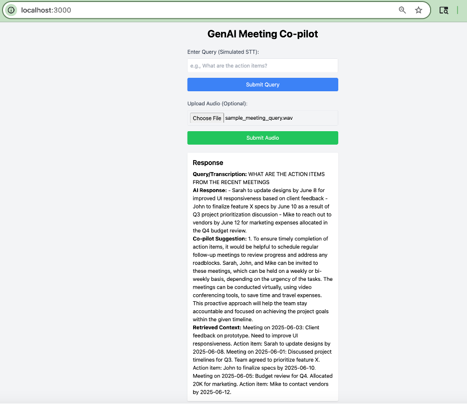
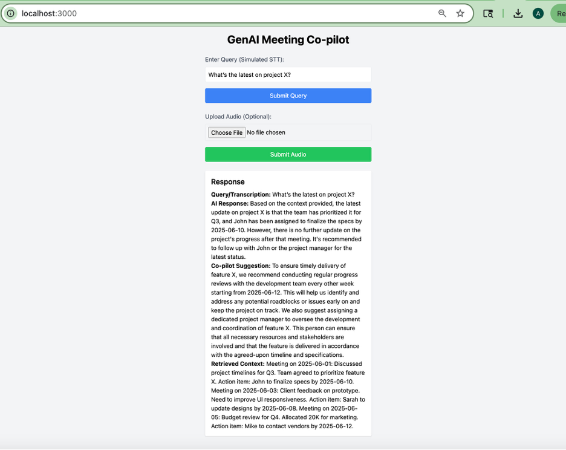

# 🚀 GenAI Meeting Co-pilot

The app listens, analyzes, provides contextual prompts, and performs actions like mock web searches and CRM updates, aligning with the vision of a **"super-agent" for online conversations**.

---

## 📌 Project Overview

This project implements a GenAI-powered meeting co-pilot using **Speech-to-Text (STT)**, **RAG**, **Agentic RAG**, and **AI Agents via LangGraph**. It processes user queries (text or audio), retrieves relevant meeting notes from a PostgreSQL vector store, generates responses, and provides actionable co-pilot suggestions. The system also demonstrates agentic capabilities by simulating external actions like web searches and CRM updates.

---

## 🛠️ Tech Stack

- **Backend**: Python, FastAPI, LangChain, LangGraph, HuggingFace (Zephyr-7b-beta), PGVector, PostgreSQL  
- **STT**: HuggingFace `facebook/wav2vec2-base-960h` for audio transcription  
- **Frontend**: React  
- **Dependencies**: `torchaudio`, `transformers`, `langchain-huggingface`  

---

## ✨ Key Features

### 1. Speech-to-Text (STT)
- Transcribes audio inputs using `wav2vec2-base-960h` with audio normalization for improved quality.
- Supports low-latency processing, with transcription latency logged.
- **Contribution**: Integrated STT with the LangGraph workflow.

### 2. Retrieval-Augmented Generation (RAG)
- Uses PGVector to store and retrieve meeting notes with `sentence-transformers/all-MiniLM-L6-v2` embeddings.
- Retrieves up to 5 relevant documents (`k=5`) for broader context.
- Optimized `analysis_prompt` to evaluate context relevance accurately.
- **Contribution**: Tuned the RAG pipeline for effective context retrieval.

### 3. Agentic RAG with LangGraph
- Added `fetch_external` node to simulate web searches when context is insufficient.
- Added `update_crm` node to demonstrate action-taking (mock CRM updates).
- **Contribution**: Developed agentic workflow to enable decision-making and external actions.

### 4. AI Agent Capabilities
- The LangGraph agent decides whether to generate a response, request clarification, or fetch external data based on context analysis.
- Simulates “super-agent” features like web searches and CRM updates, aligning with the JD’s requirements.
- **Contribution**: Built a stateful agent using LangGraph to handle complex meeting scenarios.

---

## ⚙️ Setup Instructions

1. **Clone the repository**:  
   ```bash
   git clone <repo-url>
   ```

2. **Verify installations**:  
   ```bash
   node --version  
   npm --version  
   python3 --version  
   psql --version  
   git --version  
   ```

3. **Create a virtual environment to manage Python dependencies**:  
   ```bash
   python3 -m venv venv  
   source venv/bin/activate  
   pip install --upgrade pip  
   ```

4. **Install backend dependencies**:  
   ```bash
   pip install -r requirements.txt  
   ```

5. **Set Up PostgreSQL and pgvector**:  
   ```bash
   brew services start postgresql  
   createdb meeting_copilot  
   psql -d meeting_copilot -c "CREATE EXTENSION vector;"  
   ```

6. **Set Hugging Face API Token**

   Inside the `backend` folder, create a `.env` file with the following content:
   ```env
   HUGGINGFACEHUB_API_TOKEN=your_token_here
   DATABASE_URL=postgresql://localhost:5432/meeting_copilot
   ```

  Get a free Hugging Face API token from [your Hugging Face account settings](https://huggingface.co/settings/tokens) and replace `your_token_here` with the actual token.

7. **Run the script to load sample data**:  
   ```bash
   python populate_db.py  
   ```

8. **Run the backend**:  
   ```bash
   python -m uvicorn main:app --reload  
   ```

9. **Access the frontend at**:  
   ```
   http://localhost:3000 (after npm start)
   ```

---

## 📡 API Endpoints

- `POST /stt`: Process text queries with RAG and agentic responses.  
- `POST /stt_audio`: Transcribe audio and process with RAG.  
- `POST /copilot`: Generate co-pilot suggestions.  
- `POST /rag`: Explicit RAG query processing.  

---

## 🔮 Future Improvements

- Implement real-time audio streaming for STT (e.g., using WebSockets).
- Integrate actual web search APIs (e.g., SerpAPI) for dynamic context.
- Add Text-to-Speech (TTS) for spoken responses.

---

## 📝 Notes

- The project was developed in one week to meet the requirements, demonstrating rapid learning and implementation of GenAI concepts.
- The system aligns with the JD’s requirements for a real-time, context-aware AI meeting co-pilot.

---

## 🖼️ UI Demo

**1. Audio Request:**  


**2. Vague Text Request:**  

